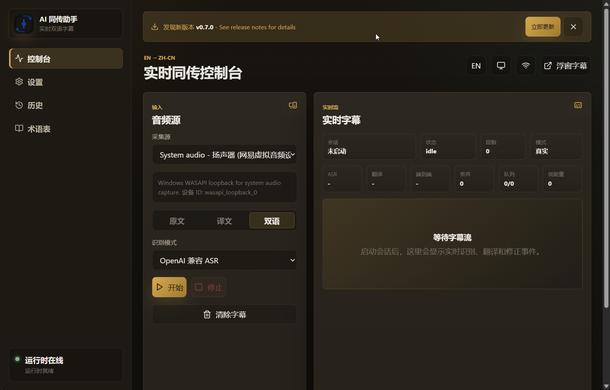

<div align="center">


# AI Interpretation Assistant

**Real-time bilingual interpretation, on your desktop.**

[](https://github.com/wynxing/online/actions/workflows/ci.yml)
[](https://github.com/wynxing/online/releases)
[](LICENSE)
[](#-supported-platforms)
[](https://tauri.app/)
[](https://www.rust-lang.org/)

[English](README.md) · [简体中文](README.zh-CN.md)

</div>

---

Capture local audio, run it through OpenAI-compatible ASR + translation, render live bilingual subtitles in the main window or a floating overlay. Built with Tauri v2 and embedded Rust — no Python sidecar, no HTTP port, no WebSocket server.

## 📸 Preview

<p align="center">
  
</p>

## ✨ Features

- 🎙️ **System audio loopback** — native WASAPI on Windows, `cpal` on macOS/Linux
- 🧠 **Audio DSP preprocessing** — RNN denoise (`nnnoiseless`), peak normalization, sinc resampling
- 🗣️ **OpenAI-compatible ASR** — Whisper API and Chat Completions with `input_audio`
- 🌐 **Glossary-aware translation** — LRU cache with language-pair keys, literal term replacement
- 🔍 **VAD segmentation** — voice activity detection with `earshot`, configurable thresholds
- 🛡️ **Hallucination filtering** — drops Whisper repeat-prompt artifacts and known noise outputs
- 📺 **Floating subtitles** — always-on-top overlay with bilingual / source-only / translated-only modes
- 💾 **Local-first storage** — SQLite (WAL) for sessions, segments, glossary, config
- 🌗 **Bilingual UI** — English / 简体中文 with warm dark/light themes
- 🔄 **Auto-update** — Tauri updater plugin with signed bundles

## 🚀 Quick Start

### Prerequisites

| Tool | Version |
| --- | --- |
| Node.js | 22+ |
| npm | 10+ |
| Rust | stable (with target toolchain for your platform) |

### Install & Run

```powershell
git clone https://github.com/wynxing/online.git
cd online
npm install
npm run tauri:dev
```

For frontend-only iteration (faster reload, no Rust rebuild):

```powershell
npm run desktop
```

## 🖥️ Supported Platforms

| Platform | Audio backend | Status |
| --- | --- | --- |
| Windows 10 / 11 (x64) | WASAPI loopback (native) | ✅ Primary |
| macOS (x64 / arm64) | cpal + virtual devices (BlackHole, Loopback) | ✅ Supported |
| Linux (x64) | cpal + PulseAudio / PipeWire monitor | ✅ Supported |

## 📖 Documentation

- [Architecture](docs/architecture.md) — runtime layout, pipeline, audio DSP, hallucination detection
- [Runtime API](docs/api.md) — Tauri commands, events, `RuntimeConfig` reference
- [Development Guide](docs/development.md) — environment setup, module map, logs and data
- [Deployment](docs/deployment.md) — local release builds, CI release pipeline, update manifests
- [Changelog](CHANGELOG.md) — version history
- [Contributing](CONTRIBUTING.md) — commit conventions, PR process, code style

## 🏗️ Architecture

```text
Audio capture → DSP (denoise · normalize · resample) → segmenter (VAD)
              → ASR → hallucination filter → translation → SQLite
              → Tauri events → React UI (main + floating)
```

See [docs/architecture.md](docs/architecture.md) for the full diagram and detailed breakdown.

## 🛠️ Development

### Common Commands

| Command | Purpose |
| --- | --- |
| `npm run tauri:dev` | Start the full desktop app (frontend + Rust runtime) |
| `npm run desktop` | Frontend-only Vite dev server |
| `npm run lint` | ESLint on TypeScript |
| `npm run test` | Vitest frontend tests |
| `npm run desktop:build` | Production frontend build |
| `cargo test --manifest-path apps/desktop/src-tauri/Cargo.toml` | Rust tests (74 tests) |
| `npm run release:local` | Local release bundle |

### Project Layout

```text
apps/desktop/
├── src/                    # React UI (TypeScript + Vite)
│   ├── components/         # ControlPanel, SettingsPanel, SubtitlePanel, FloatingSubtitles, ...
│   ├── hooks/              # useSubtitleSocket, useTheme, useUpdateChecker
│   ├── i18n/               # en / zh locales
│   └── styles/             # Modular CSS (tokens, base, panels, animations)
└── src-tauri/
    └── src/
        ├── commands/       # Tauri invoke handlers (14 commands)
        ├── api/            # ASR sanitizer + client, translation client, retry
        ├── audio/          # WASAPI / cpal device discovery and capture
        ├── pipeline/       # mod.rs (orchestrator) + audio_dsp.rs (DSP)
        ├── storage/        # SQLite via rusqlite (WAL mode)
        ├── models.rs       # Serde models shared with TypeScript
        └── state.rs        # AppState
docs/                       # User and developer documentation
scripts/                    # Build, release, version-bump scripts
```

### Data Directory

Runtime data lives under `~/.online/` by default (override with `ONLINE_DATA_DIR`):

```text
~/.online/
├── runtime.sqlite3
└── logs/
    └── runtime.log
```

## 🤝 Contributing

Contributions are welcome. Please read [CONTRIBUTING.md](CONTRIBUTING.md) before opening a pull request.

- Bug reports and feature requests: [GitHub Issues](https://github.com/wynxing/online/issues)
- Commit format: [Conventional Commits](https://www.conventionalcommits.org/)
- Pre-commit hooks (Husky + lint-staged) run ESLint and Prettier automatically.

## 📄 License

Released under the [MIT License](LICENSE). Copyright © 2026 AI Interpretation Team.

## 🙏 Acknowledgments

Built on top of these excellent open-source projects:

- [Tauri](https://tauri.app/) — the desktop framework
- [nnnoiseless](https://github.com/jneem/nnnoiseless) — RNN-based noise suppression
- [rubato](https://github.com/HEnquist/rubato) — high-quality audio resampling
- [earshot](https://crates.io/crates/earshot) — voice activity detection
- [cpal](https://github.com/RustAudio/cpal) — cross-platform audio I/O
- [rusqlite](https://github.com/rusqlite/rusqlite) — SQLite bindings for Rust
